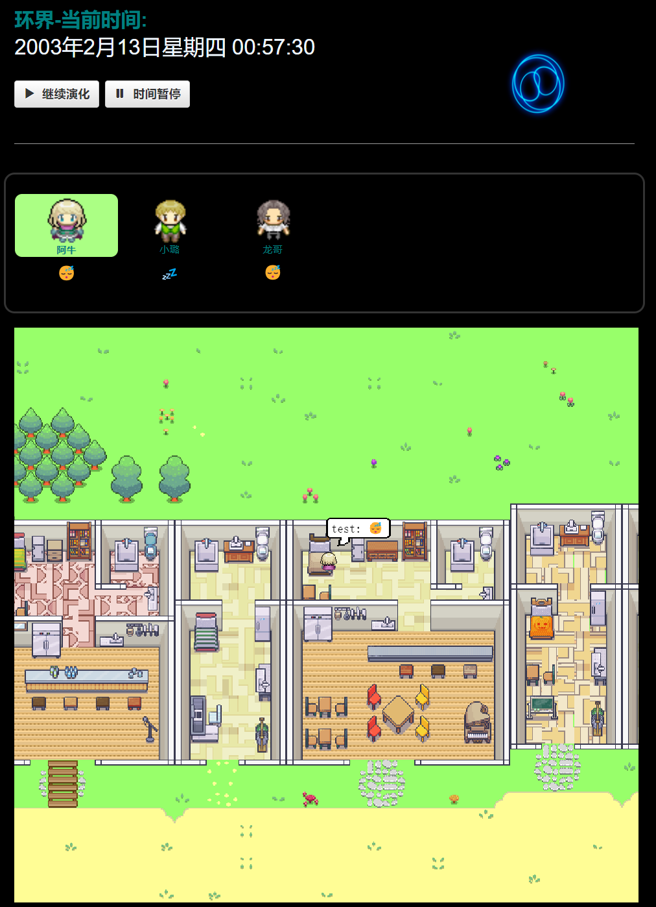

# 环界：基于生成式大模型的AI仿真模拟世界

<p align="center" width="100%">

本项目是以斯坦福开源项目 "[Generative Agents: Interactive Simulacra of Human Behavior](https://arxiv.org/abs/2304.03442)." 为基础，进行的魔改、汉化、优化与移动端适配开发，主要包含生成式多智能体的模拟仿真环境和对应的前端展示。此外，我们也保留了斯坦福原项目对于仿真的行为记录模块，可以离线本地进行环境replay

### 项目Feature
- 支持中文界面
- 优化调用速度
- 支持本地LLM
- 可适配移动端

### 开发日志
- 原始论文demo与本地调试开发 (2023-07)
- 底层+界面汉化; 自定义人物背景
- 移动端适配（HarmonyOS） (2023-08)
- 修复了刷新网页或点击人物状态后崩溃的BUG
- 修复了本地调用模型时Exception的BUG
- AtomicService应用测试 (2023-09)
- 增加Few-shot learning Example
- 优化大模型返回的文字表达（东北腔）
- 新增LLaMa2-7b/GPT4ALL/Falcon-7b/文心大模型

##    环境设置 

- 基本环境和论文保持一致，Python==3.9.12（兼容旧版本，我用的3.8也可以，3.10不确定）
<br>

首先
```
pip install -r requirements.txt
```
修改`reverie/backend_server`目录下的 `utils.py` 文件，在里面替换上你自己的<Your OpenAI API>和系统名称<Name>.

### Step 1. 生成工具文件
```
# 如果用chatgpt接口，选择OpenAI API Key
openai_api_key = "<Your OpenAI API>"

# 如果用localGPT接口，参考https://observablehq.com/@simonw/gpt4all-models
gpt4all_model="orca-mini-3b.ggmlv3.q4_0.bin"
max_tokens = 30
temperature = 0.5

# 如果用LLAMA-2，注意GPT调用的函数方式
response = completion(model="meta-llama/Llama-2-7b-hf", messages=messages)

# 起个名字
key_owner = "<Name>"

# Verbose 
debug = True
```

### Step 2. 测试模型生成
测试模型的调用和生成结果是否正常，确认无误后再进行“运行仿真”步骤。大模型生成有时会不按格式，可以尝试修改prompt。
<br>
在项目根目录下直接执行`python test.py`,在test.py文件中内置了4种调用方法：
```aidl
ChatGPT_request(prompt)
ChatGPT_turbo_request(prompt)
GPT4_request(prompt)
GPTLocal_request(prompt)
```
可以根据自己的设置更加或添加新的大模型，目前中文生成效果最好的有
- ChatGPT(GPT-4) API
- Ernie Bot V2.0
- LLAMA2-chinese ver

个人经验是一张RTX 4070显卡可以以中等速度跑7B的LLAMA2，而直接调API的方法会快很多（但贵）

## 运行仿真

AI模拟小镇需要启动2个服务，一个环境服务（Django，常驻）一个智能体服务（支撑AI决策）

### Step 1. 启动环境服务
环境服务依赖于Django server. 首先CD到 `environment/frontend_server`目录下，然后运行以下命令:

    python manage.py runserver 0.0.0.0:8000

用浏览器打开以下网址（推荐Chrome）[http://localhost:8000/](http://localhost:8000/). 如果你看到 "环境已启动并正常运行中..." 就代表启动成功. 注意，这个服务要常驻，如果你没有在后台挂起，那么你的CMD必须时刻打开。

### Step 2. 启动仿真服务

再打开一个CMD，切换到 `reverie/backend_server` 目录下然后：

    python reverie.py

仿真服务器随后会启动，然后提示你 "输入智能体名称: ". 这里我们使用斯坦福自带的3智能体测试用例——Isabella Rodriguez, Maria Lopez, and Klaus Mueller,:
    
    base_the_ville_isabella_maria_klaus

然后会弹出第二行提示, "输入仿真的名字: ". 随便起一个就行，比如"test-simulation".

    test-simulation

最后会提示: "输入选项: "，先别管，跳到下一步

### Step 3. 运行与保存
用浏览器打开以下网址[http://localhost:8000/simulator_home](http://localhost:8000/simulator_home). 如果你能看到AI小镇的页面，并且可以用键盘上下左右移动视角，那么代表你的服务启动成功了。注意，原版的代码在你刷新网页或点击人物状态后会直接崩溃，这一版我们修复了这个BUG。

确保网页正常后，回到第二个CMD里，在"输入参数: "后写上你要运行的仿真步数（就是你想让这个AI世界运行的步数）

    run <步数>
把 `<步数>`用一个整数替代，不要太大一般5-20即可，比如 `run 10`。

此时回到网页，你会观察到AI们开始移动和变化状态了。如果没有动，是因为DEMO运行需要先生成再显示，等几分钟再看看。运行完成后，会再度出现输入选项的提示，你可以继续生成、退出或者保存。 

退出指令为`exit`, 保存指令为 `fin`.

保存的仿真进度会在你下一次的仿真服务启动时获取，你可以直接进行回放。 

### Step 4. 虚拟世界
环界的运行并不是实时的，而是有延迟的。是由模型生成N个时间步后，再通过replay映射到前端。

要完成replay，首先按照前两步打开服务（如果你没关闭环境服务，可以只启动仿真服务）
进入回放页面: `http://localhost:8000/replay/<simulation-name>/<starting-time-step>`. 这里 `<simulation-name>` 是你之前命名的仿真名称, `<starting-time-step>` 对应你想从第几个时间步开始回放.

默认生成的回放目前只支持debug，页面展示的人物都是一样的，如果要完整回放，先找到`reverie`文件夹下面的`compress_sim_storage.py`，把你要回放的仿真名称作为参数传给`compress`函数.

比如，我要从第10秒钟开始，回放ringworld这个保存的仿真:  
[http://localhost:8000/demo/ringworld/1/3/](http://localhost:8000/demo/ringworld/1/3/)

这里多出来的子页面参数`<simulation-speed>` 指的是回放速度, 最小为1，最大为5，速度递增。

### 小贴士
默认的模型用的是OPENAI，仿真体超过10个，每调用10个step你就会失去一个KFC吮指原味鸡，所以建议step调小点先试试，不要反复用100 step来跑。

此外，国内用户调用API时可能会遇到网络不稳定导致调用失败 (code!=200) 我们加入了运行中实时保存的功能，避免重新跑一遍

## 仿真存储
仿真默认的保存位置在 `environment/frontend_server/storage`, 所有压缩过的demo则放在 `environment/frontend_server/compressed_storage`. 

## DIY
另外这一版本也支持更多个性化开发，比如
### 修改智能体背景
你可以尝试给每个智能体赋予更加独一无二的背景，步骤如下:

#### Step 1. 启动基础环境 
跟之前的步骤一样，打开两个服务，运行仿真环境

#### Step 2. Loading a History File 
在"输入参数: "中，使用这个命令来让模型读取你自定义的人物背景描述:

    call -- load history the_ville/<history_file_name>.csv

你可以直接重新写一个，也可以在已有的文件里改，主要有两个，`agent_history_init_n25.csv`和`agent_history_init_n3.csv` 注意：格式要与原始的CSV保持一致

#### Step 3. Further Customization 
最后把你的文件放到这个文件夹下: `environment/frontend_server/static_dirs/assets/the_ville`.


## 参考资料
**Authors:** Joon Sung Park, Joseph C. O'Brien, Carrie J. Cai, Meredith Ringel Morris, Percy Liang, Michael S. Bernstein

Please cite our paper if you use the code or data in this repository. 
```
@inproceedings{Park2023GenerativeAgents,  
author = {Park, Joon Sung and O'Brien, Joseph C. and Cai, Carrie J. and Morris, Meredith Ringel and Liang, Percy and Bernstein, Michael S.},  
title = {Generative Agents: Interactive Simulacra of Human Behavior},  
year = {2023},  
publisher = {Association for Computing Machinery},  
address = {New York, NY, USA},  
booktitle = {In the 36th Annual ACM Symposium on User Interface Software and Technology (UIST '23)},  
keywords = {Human-AI interaction, agents, generative AI, large language models},  
location = {San Francisco, CA, USA},  
series = {UIST '23}
}
```

